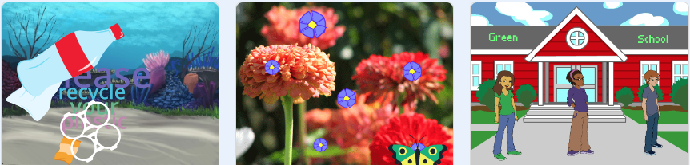

## You will make

Create a digital card 💌 to send to someone for World Environment Day.

World Environment Day is celebrated by the United Nations every year on 5 June. It has been celebrated since 1973. It is a day to encourage people to think about the environment and take action to protect it.

Once you have made your card, your Code Club can choose their favourite card to share with another Code Club in the UK, and receive a card in return!
Your card could be about the environment in your local area, or about an environmental issue that you care about. You could also think of your own idea.

You will:

+ Create a digital card for someone about your chosen topic
+ Choose which skills to use to make your card
+ Share a web address for your card

--- no-print ---

--- task ---

### Play ▶️ 

Click the green flag

What happens when you click on the moving objects?

What sounds play?

Which blocks do you think were used?

**World Environment Day**: [See Project Page](https://scratch.mit.edu/projects/460628546){:target="_blank"}

  <iframe src="https://scratch.mit.edu/projects/460628546/embed" allowtransparency="true" width="485" height="402" frameborder="0" scrolling="no" allowfullscreen></iframe>

--- /task ---

--- /no-print ---

Your card will need to meet the **project brief**.

A **project brief** describes what a project must do. It is a bit like being given a mission to complete.

### 🎯 PROJECT BRIEF: Create a **digital card** to celebrate World Environment Day

You will need to decide what type of card you would like to make.

Your card should have:
+ 🖼️ A backdrop to set the scene
+ 🐢 At least one sprite
+ 💬 Text or speech to share a message

Your card could have:
+ 🔉 Sound effects or music
+ 🎨 Costumes you have painted or edited in the Paint editor
+ 🖱️ Interactive features to click

--- no-print ---

### Get ideas 💭

--- task ---

Play with these example projects to get ideas for your card:

⭐ Share your finished project for a chance of it being featured here.

**Green school 🏫**: [See inside](https://scratch.mit.edu/projects/992775478){:target="_blank"}

  <iframe src="https://scratch.mit.edu/projects/992775478/embed" allowtransparency="true" width="485" height="402" frameborder="0" scrolling="no" allowfullscreen></iframe>

**Beach clean 🏖️**: [See inside](https://scratch.mit.edu/projects/992770228){:target="_blank"}

  <iframe src="https://scratch.mit.edu/projects/992770228/embed" allowtransparency="true" width="485" height="402" frameborder="0" scrolling="no" allowfullscreen></iframe>

**Pollination animation 🦋**: [See inside](https://scratch.mit.edu/projects/996923965){:target="_blank"}

  <iframe src="https://scratch.mit.edu/projects/996923965/embed" allowtransparency="true" width="485" height="402" frameborder="0" scrolling="no" allowfullscreen></iframe>

--- /task ---

--- /no-print ---

--- print-only ---

### Get ideas 💭

To get ideas for your card 💌, **See inside** example projects in the 'World Environment Day' Scratch studio: 
https://scratch.mit.edu/studios/35028571

--- /print-only ---

