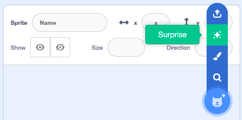
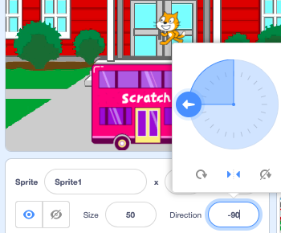
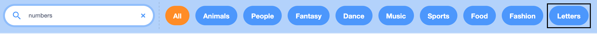

## Make 🧱 and test 🔄

Now, it's time to make your digital card. Start small, and add more to your project if you have time. 

**Tip:** Remember to test your project each time you add something. 🐞 It is much easier to find and fix bugs before you make more changes.

Some useful skills you could use for your card:  
+ Add code to sprites and a backdrop
+ Customise sprites in the Paint editor
+ Add `graphic effects`{:class="block3looks"}, `motion`{:class="block3motion"}, and `sound`{:class="block3sound"} to a sprite
+ Use the `forever`{:class="block3control"} and `repeat`{:class="block3control"} loop blocks
+ Use the `next costume`{:class="block3looks"} and `wait`{:class="block3control"} blocks to animate a sprite
+ Use `layers`{:class="block3looks"} blocks to move sprites in front of or behind other sprites
+ Use the `text to speech`{:class="block3extensions"} and `translate`{:class="block3extensions"} Scratch extensions 


## Set the scene 🖼️

--- task ---

Add the backdrop and sprites. 


### Backdrops

[[[generic-scratch3-backdrop-from-library]]]

[[[scratch3-paint-a-new-backdrop-extended]]]


### Sprites

Add a sprite:

[[[generic-scratch3-sprite-from-library]]]

[[[scratch3-backdrops-and-sprites-using-shapes]]]

--- collapse ---
---
title: Get a surprise sprite
---

Not sure which sprite to choose? Go to the **Choose a Sprite** menu and choose the **Surprise** option to add a surprise sprite to your project.



--- /collapse ---

Edit a Sprite's costumes:

[[[scratch3-add-costumes-to-a-sprite]]]

[[[scratch3-copy-parts-between-sprite-costumes]]]

--- /task ---

## For each sprite 🐈 🐢 🎈

You will probably need to add code to each sprite in your card. 

Consider whether they will do anything when the project starts, or when the sprite is clicked. 

For example:
+ "When the user clicks on the green flag, a sprite moves"
+ "When the user clicks on a sprite, the sprite changes colour"

--- collapse ---
---
title: Start code with Hat blocks
---

```blocks3
when green flag clicked
when this sprite clicked
```

These blocks have a different shape — they are sometimes called **Hat blocks**. They start code running when a particular event happens, such as a user clicking.

--- /collapse ---

--- task ---


### Prepare your Sprites

Think about:
+ `Looks`{:class="block3looks"} size, layers, visibility
+ `Motion`{:class="block3motion"} direction, starting position


--- collapse ---
---
title: Resize your sprites
---

### Set size for the whole project

Change the number in the **Size** property in the Sprite pane:


### Change size for part of the project

Add code to `set size to`{:class="block3looks"} the size of your choice. This option is good if you want your sprite to change size in the project. 

```blocks3
set size to [100] % // <100 is smaller, >100 is bigger
```

--- /collapse ---

[[[scratch3-positioning-with-layers]]]

--- collapse ---
---
title: Hide and show sprites
---

To make one sprite appear to turn into another sprite you could `show`{:class="block3looks"} one sprite and `hide`{:class="block3looks"} the other. After a `wait`{:class="block3control"} you can then `hide`{:class="block3looks"} the first sprite and `show`{:class="block3looks"} the second: 

The 🎂🎾🎁 **interesting object** sprite:
```blocks3
when flag clicked
show
wait (5) seconds
hide
```

The 🎷👻⚡**surprise object** sprite:
```blocks3
when flag clicked
hide
wait (5) seconds
show
```

**Tip:** If you make a 🎷👻⚡**surprise object** sprite `show`{:class="block3looks"}, you will need to make it `hide`{:class="block3looks"} `when green flag clicked`{:class="block3events"}.

--- /collapse ---

--- collapse ---
---
title: Set the direction of your sprites
---

Your sprites might be facing the wrong way when you add them to your project. 

### Set direction for the whole project

Change the **Direction** and **rotation style** in the Sprite pane:



### Change direction for part of the project

Add blocks to your code to change the `rotation style`{:class="block3motion"} and `direction`{:class="block3motion"}:

```blocks3
set rotation style [left-right v]
point in direction (-90) // turn to the left
```

--- /collapse ---

--- collapse ---
---
title: Set the starting position and looks for a sprite
---

Drag the sprite to the starting position then add the `go to x: y:`{:class="block3motion"} block.

**Tip:** The values in the block will be the position you have moved the sprite to.

```blocks3
when flag clicked 
go to x: (-200) y: (50) // starting position
```

--- /collapse ---

--- /task ---

--- task ---

### Add movement and sound

Choose how to animate your card with `costumes`{:class="block3looks"}, `graphic effects`{:class="block3looks"}, `motion`{:class="block3motion"} and `sound`{:class="block3sound"}: 

**Tip:** Some of the best ideas come from playing. You will find good ideas by accident!

### Costumes 👓

--- collapse ---
---
title: Make a sprite change costume when clicked
---

**Gobo with costume accessories**: [See inside](https://scratch.mit.edu/projects/496334057/editor){:target="_blank"}
<div class="scratch-preview">
<iframe allowtransparency="true" width="485" height="402" src="https://scratch.mit.edu/projects/embed/496334057/?autostart=false" frameborder="0"></iframe>
</div>

Some sprites already have a choice of costumes.

You can add code to make a sprite's costume change to the `next costume`{:class="block3looks"} when you click on the sprite:

```blocks3
when this sprite clicked
next costume
```

--- /collapse ---

[[[scratch3-change-costumes-to-show-mood]]]

[[[scratch3-animate-movement-costumes]]]


### Graphic effects 🎨

--- collapse ---
---
title: Change graphic effects when the sprite is clicked
---

```blocks3
when this sprite clicked  
change [color v] effect by (25)
```

--- /collapse ---

[[[scratch3-graphic-effects]]]


### Movement 🏃‍♀️

[[[scratch3-jiggle-a-sprite]]]

--- collapse ---
---
title: Make a sprite point towards the mouse pointer
---

```blocks3
when flag clicked
set rotation style [all around v]
forever
point towards (mouse-pointer v)
end
```

--- /collapse ---

[[[scratch3-animate-movement-costumes]]]


### Sound 🔊

[[[scratch3-add-sound]]]


--- /task ---

## Your message

--- task ---

**Choose:** Add your message as either a **sprite/sprites** or a **sound**:
+ Add letter sprites from the Sprite library
+ Use the **Text** tool in the Paint editor to write a short message
+ Record a spoken message
+ Type a message for Scratch to speak

--- collapse ---
---

title: Use letter sprites from the Sprite library

---

**Choose a Sprite** and select **Letters** from the Sprite Library or search for `numbers`:
{:width="300px"}

--- /collapse ---

[[[scratch3-use-text-tool]]]

[[[scratch3-record-sound]]]

[[[scratch3-text-to-speech]]]

--- /task ---

### Scratch editor reminders

--- task ---

[[[scratch3-copy-code]]]

[[[scratch3-full-screen]]]

[[[scratch3-duplicate-sprite]]]

--- /task ---

--- task ---

**Test:** 🔄 Show someone else your project and ask for 🗣️ their feedback. Do you want to make any changes to your card? 

⏱️ If you have time, you can upgrade your project. 

💡 You could:
- Add more code to your sprites
- Add another sprite
- Record or add a sound 
- Create a new costume in the Paint editor

If you are stuck for ideas, you can look at the ['World Environment Day' examples](https://scratch.mit.edu/studios/35028571){:target="_blank"} and **See inside**.

If you have finished or don't have much time left, then move on to the next step to share your digital card.

--- /task ---

--- task ---

**Debugging** is finding and fixing mistakes in your code that are called **bugs** 🐞. 

You might find some bugs in your project that you need to fix. Here are some common bugs:

--- collapse ---
---

title: Debugging tips

---

+ **My sprite is going upside down** — Add a `set rotation style left-right`{:class="block3motion"} or `set rotation style don't rotate`{:class="block3motion"} block.

+ **My sprite 'jumps' when it changes costume or bounces** — Make sure that the costume is centred in the Paint editor (line up the blue cross with the cross hairs in the centre of the Paint editor).

+ **My sprite stops when it gets to the edge of the Stage** — Add an `if on edge, bounce`{:class="block3motion"} block.

+ **My sound does not play** — Have you added a block to `play sound`{:class="block3sound"} when the sprite is clicked? If you have copied code from another sprite, you will need to add the sound to this sprite from the **Sounds** tab. Check the volume on your computer and make sure that you have not lowered the volume with code — try `set volume to`{:class="block3sound"}`100`.

+ **Other sprites keep going in front of my sprite** — Use a `go to front layer`{:class="block3looks"} block.

+ **My sprite only moves/changes once** — Put your code inside a `forever`{:class="block3control"} block so it keeps running.

+ **My sprite does not change when I move a variable slider** — Put your code inside a `forever`{:class="block3control"} block so it keeps updating. 

--- /collapse ---

You might find a bug that is not listed here. Can you work out how to fix it?

🗣️ We love hearing about your bugs and how you fixed them. Use the **Send feedback** button at the bottom of this page and tell us if you found a different bug in your project.

--- /task ---

--- save ---

